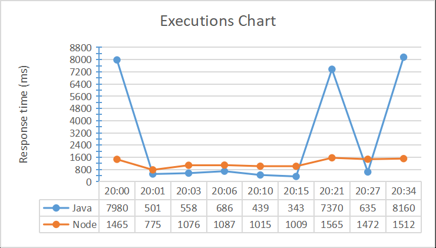

# AWS-Lambda-Project

Project is part of the final work of the Systems Analysis and Development course, 
where the objective was to make a comparative analysis between the performance of the languages 
and pointing out how the Node language can be an alternative to the cold start latency of FaaS applications with low frequency of requests.

Project includes AWS lambda codes developed in Node and Java




### 📋 Requirements

The following items should be installed in your system:
* Java 11 or newer (full JDK not a JRE).
* Your preferred IDE
    * [IntelliJ IDEA](https://www.jetbrains.com/idea/)
    * [VS Code](https://code.visualstudio.com)

### 🔧 Install Application

- Clone the Git repository or download the zip.

```
git clone https://github.com/fspaulo/AWS-Lambda-Project
```

### ⚙ Build Java Application
```
mvn clean install
```
The above command compiles the sources, runs the tests and packages the compiled files into a JAR file in the target folder. 
The generated jar will be uploaded in the lambda function.

### ✒️ Autor

* **Paulo Otávio Ferreira dos Santos** - [LinkedIn](https://www.linkedin.com/in/paulo-otavio-ferreira/)

